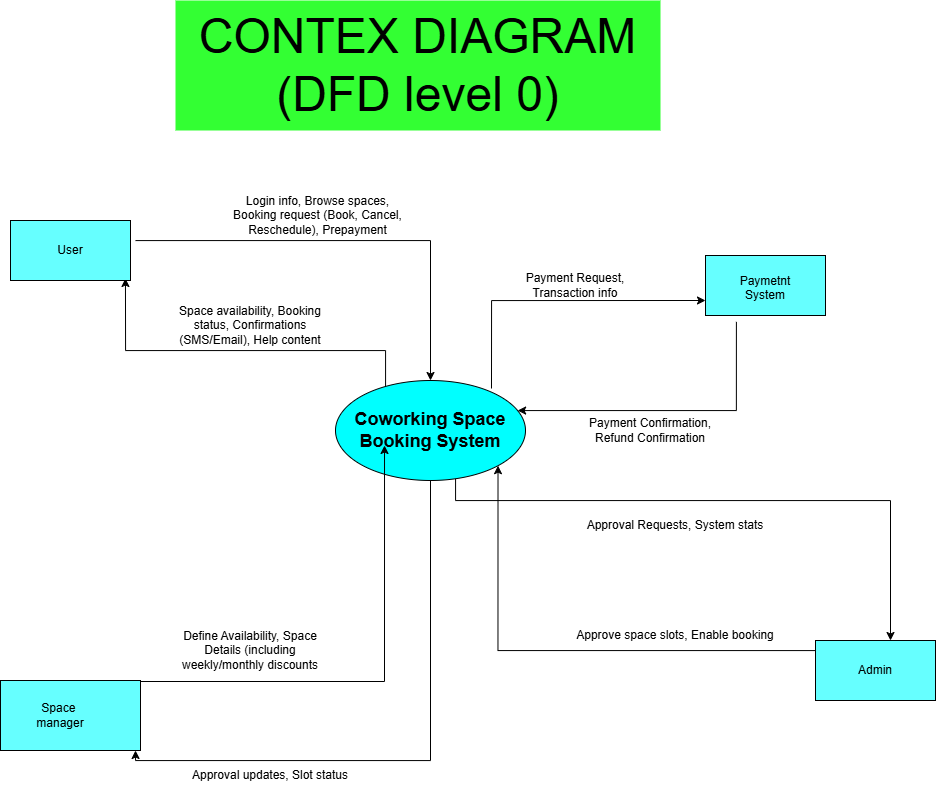
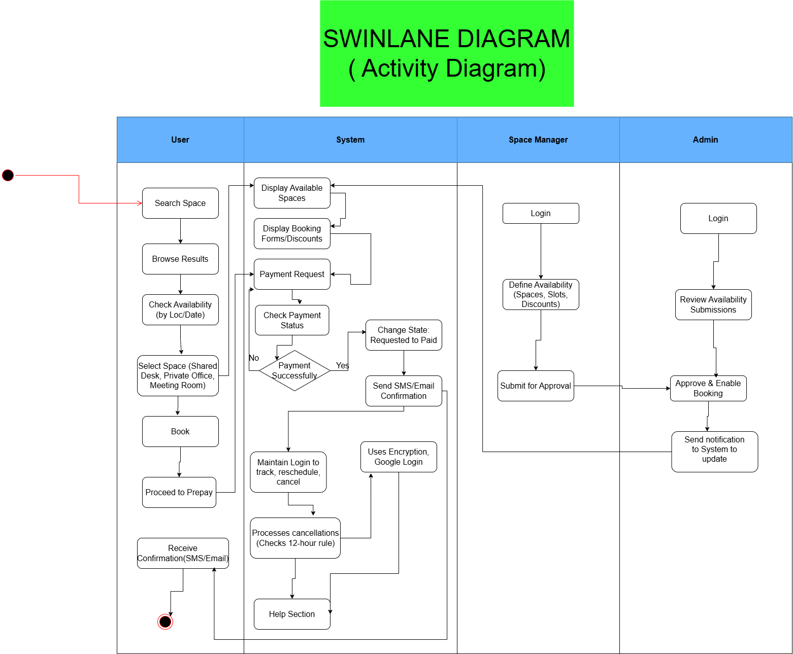
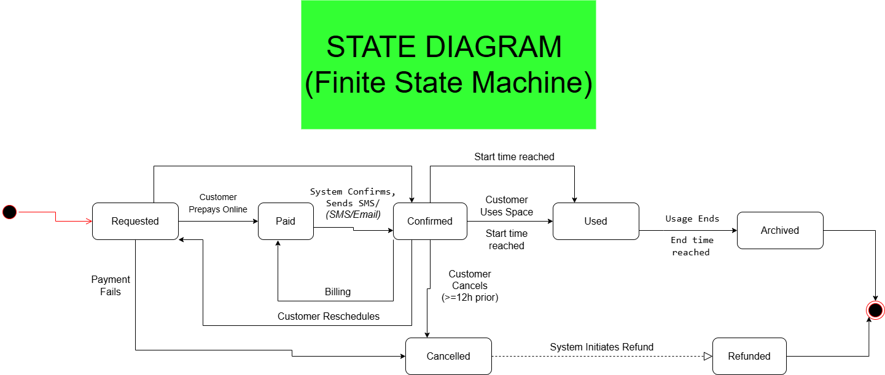

# Coworking Space Booking System — Giải thích 3 sơ đồ

Tài liệu này trình bày **chi tiết theo đúng hình vẽ** của Context Diagram, Swimlane Diagram và State Diagram.

## 6.1. Context Diagram (DFD Level 0)
Trong hình, hệ thống nằm ở trung tâm và trao đổi dữ liệu với bốn tác nhân bên ngoài. Các nhãn trên mũi tên thể hiện đúng nội dung trao đổi.

| Tác nhân ngoài hệ thống | Dữ liệu đi vào hệ thống | Dữ liệu đi ra khỏi hệ thống |
| --- | --- | --- |
| **User** | Browse spaces, Select slot, Login, Book, Cancel, Reschedule, Track; **Prepayment** | Confirmations; Status/Availability/Space info; **Prepay, Billing** |
| **Space Manager** | Define Availability, Space Details (including weekly/monthly discounts) | Defined Availability, Status, Approval Updates |
| **Admin** | Approve Space slots, Enable Booking | Approval Requests, Defined Availability, System Stats |
| **Payment System** | **Payment Confirmation, Refund Confirmation** | **Payment Request, Transaction info** |

**Ý nghĩa:** Context Diagram cho thấy toàn bộ luồng trao đổi giữa người dùng, quản lý, admin và cổng thanh toán với hệ thống đặt chỗ. Các nghiệp vụ chính như **prepay**, **duyệt slot**, **hoàn tiền** và **xác nhận** đều thể hiện qua các mũi tên dữ liệu.

## 6.2. Swimlane Diagram (Activity Diagram)
Swimlane thể hiện quy trình đặt chỗ theo từng vai trò đúng như trong hình, từ tìm kiếm đến xác nhận.

| Lane | Chuỗi hoạt động thể hiện trong hình |
| --- | --- |
| **User** | Search Space → Browse Results → Check Availability (by Loc/Date) → Select Space (Shared Desk, Private Office, Meeting Room) → Book → Proceed to Prepay → Receive Confirmation (SMS/Email) |
| **System** | Display Available Spaces → Display Booking Forms/Discounts → Payment Request → Check Payment Status → **Payment Successfully?** → **Yes:** Change State Requested to Paid → Send SMS/Email Confirmation → Paid → Maintain Login to track/reschedule/cancel → Processes cancellations (checks 12-hour rule) → Help Section; ngoài ra hỗ trợ **Uses Encryption, Google Login** |
| **Space Manager** | Login → Define Availability (Spaces, Slots, Discounts) → Submit for Approval |
| **Admin** | Login → Review Availability Submissions → Approve & Enable Booking → Send notification to System to update |

**Điểm kết nối quan trọng:** luồng “Submit for Approval” của Manager chuyển sang Admin để duyệt, sau đó Admin gửi thông báo cập nhật về hệ thống trước khi người dùng có thể đặt chỗ.

## 6.3. State Diagram (Space Reservation)
State Diagram mô tả vòng đời của một **Space Reservation** và các nhánh xử lý theo đúng nhãn trong hình.

**Luồng chính**
Start → **Requested** → *(Customer prepays online)* → **Paid** → *(System confirms, sends SMS/Email)* → **Confirmed** → *(Start time reached)* → **Used** → *(Usage ends / End time reached)* → **Archived**

**Nhánh hủy/hoàn tiền**
- **Requested → Cancelled:** Payment fails hoặc User cancels request.
- **Confirmed → Cancelled:** Customer cancels (>=12h prior).
- **Cancelled → Refunded:** System initiates refund.

**Nhánh đổi lịch**
- **Cancelled → Requested:** Customer reschedules.

**Ghi chú trong hình:** phần **Billing** diễn ra khi đã ở trạng thái **Paid** trước khi hệ thống chuyển sang **Confirmed**.

